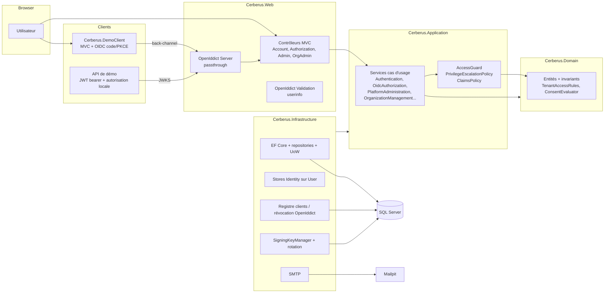

# 02 - Architecture cible, décisions et choix de la bibliothèque OIDC

## 1. Composants

## 2. Dépendances entre projets

| Projet | Dépend de | Interdit (vérifié par `Cerberus.ArchitectureTests`) |
|---|---|---|
| Domain | aucun | EF, ASP.NET Core, OpenIddict, Microsoft.Extensions |
| Application | Domain | Infrastructure, Web, EF, ASP.NET Core, OpenIddict |
| Infrastructure | Domain, Application | Web |
| Web | Application, Infrastructure | Repositories et DbContext dans les contrôleurs |
| DemoClient | aucun projet (packages seulement) | |

**Pourquoi Web référence Infrastructure :** composition des dépendances, comme dans la référence.

**Pourquoi Web dépend d'OpenIddict :**
- La configuration du serveur et les endpoints passthrough sont des adaptateurs HTTP du protocole.
- Toute règle métier (tenant, consentement, claims) est dans Application et Domain, testable sans HTTP.

## 3. Décisions d'architecture

| # | Décision | Alternatives | Justification | Conséquences |
|---|---|---|---|---|
| D1 | **OpenIddict 7.7** (validé par l'utilisateur) | Duende IdentityServer, implémentation maison | Voir section 4 | Cerberus reste maître de l'UI et des règles ; endpoints en passthrough |
| D2 | **ASP.NET Core Identity via stores personnalisés** sur `User` du domaine (`UserStore`) | `IdentityDbContext`/`IdentityUser` ; hachage maison | Réutilise PBKDF2 (hasher V3), le lockout, le security stamp et les tokens reset/confirmation sans crypto maison. Le domaine reste sans dépendance | `UserManager` persiste immédiatement (documenté dans les services) |
| D3 | **SQL Server** (validé) | PostgreSQL | Cohérence avec la référence | Conteneur `mssql/server:2022` |
| D4 | **Paramètre d'autorisation `organization`** (slug ou GUID) | Scope `org:xxx`, `acr_values`, sous-domaine par tenant | Extension autorisée par OAuth 2.0 (RFC 6749 §3.1, paramètres inconnus ignorés). Même approche qu'Auth0. Pas de pseudo-standard dans les scopes | Toujours revalidé côté serveur (voir 04) |
| D5 | **Consentement par (user, client, organisation)** (validé) | Global (user, client) | Consentir pour A ne libère jamais le contexte de B (org_id, org_roles) | Un écran de consentement par organisation |
| D6 | **L'IdP ne gère que les rôles plateforme et organisation** (réponse B) | RBAC applicatif centralisé | Chaque application garde son RBAC métier | Le claim `org_roles` n'est qu'une entrée pour l'autorisation locale |
| D7 | **Access tokens JWT signés RS256, non chiffrés, 5 min** ; codes et refresh tokens chiffrés | Tokens de référence + introspection | Validation locale par les APIs via JWKS | Non révocables avant expiration : durée courte, refresh revalidé |
| D8 | **Clés RSA persistées en base, chiffrées par Data Protection** (clés DP aussi en base) | Certificats X.509 montés, Key Vault | Survit aux redémarrages et aux instances multiples, sans infrastructure externe en local | Rotation effective au redémarrage (voir 04) |
| D9 | **`ClientApplication` ≠ `OidcClient`** | Fusion | Une application (réponse A : liée à une organisation propriétaire) peut avoir plusieurs clients | L'accès organisationnel est porté par l'application |
| D10 | **Pas de global query filter EF** pour le multi-tenant | `HasQueryFilter` | Filtres explicites et obligatoires dans les signatures des repositories : lisibles, testables, pas de contournement silencieux avec `IgnoreQueryFilters` | Revue : toute nouvelle requête org-scoped doit prendre `organizationId` |
| D11 | **Pas de MediatR ni de Mapster** | Comme la référence pour Mapster | Pas de besoin : services explicites, mapping trivial | Moins de dépendances |

## 4. Comparatif des bibliothèques OIDC (.NET 10)

| Critère | OpenIddict 7.x | Duende IdentityServer 7.x | ASP.NET Core Identity seul |
|---|---|---|---|
| Compatibilité technique | net8/9/10, EF Core 10, vérifié (7.7.0) | net8+ | Natif |
| Fonctionnalités OIDC | Code + PKCE, refresh, révocation, introspection, end session, PAR, device, token exchange, mTLS | Très complètes (+ CIBA, DPoP, BFF) | **Aucune** : pas de serveur OIDC (seulement des endpoints d'API d'identité) |
| Sécurité | Validation stricte des redirect URIs, PKCE forçable, détection du rejeu de codes et refresh tokens | Équivalente, audits réguliers | N/A |
| Extensibilité | Pipeline d'événements, passthrough : UI et règles entièrement maîtrisées | Services remplaçables, UI à fournir | N/A |
| Intégration Clean Architecture | Ne dicte pas de modèle utilisateur ; stores EF remplaçables | Modèle de configuration propre, en général couplé à Identity | N/A |
| Clients et scopes | Stores applications/scopes/permissions | Stores clients/ressources | N/A |
| Gestion des claims | Destinations par claim, explicites | Profile service | N/A |
| Gestion des clés | Clés arbitraires (RSA/X.509), ordre maîtrisé | Gestion automatique des clés (édition payante) | N/A |
| Tests | Testable via `WebApplicationFactory` | Idem | N/A |
| Licence | Apache 2.0 | Commerciale (gratuite sous conditions : Community < 1 M$ de CA) | MIT |
| Coût | Aucun | Payant selon l'usage | Aucun |
| Maintenance | Active, un mainteneur principal | Société dédiée | Microsoft |
| Évolutivité | Bonne ; montée en charge par stockage partagé | Très bonne | N/A |

**Choix : OpenIddict.**
- Aucun coût de licence.
- Contrôle total des règles multi-tenant grâce au mode passthrough.
- Stockage EF Core dans le même `DbContext`.
- ASP.NET Core Identity n'est utilisé qu'en complément, pour les mécanismes de mots de passe (D2).

**Risque principal :** dépendance à un mainteneur principal. Atténuation : version épinglée (CPM), tests d'intégration couvrant le protocole.

## 5. Risques

| Risque | Impact | Atténuation |
|---|---|---|
| Access token JWT valide 5 min après révocation | Accès résiduel court | Durée courte, refresh revalidé à chaque usage, révocation des refresh tokens |
| Rotation de clé effective au redémarrage | Clé retirée utilisée plus longtemps | Rétention de 30 j, avertissement journalisé, redémarrage lors des déploiements |
| Clés Data Protection non chiffrées au repos (en base) | Lecture de la base = accès aux clés privées | En production : `ProtectKeysWithCertificate` ou Key Vault (voir 09) |
| Rate limiting en mémoire | Contournable en multi-instance | Redis ou passerelle en production |
| `UserManager` et managers OpenIddict persistent hors UoW | Écritures partielles possibles | Ordonnancement explicite, transaction pour la création de client |
