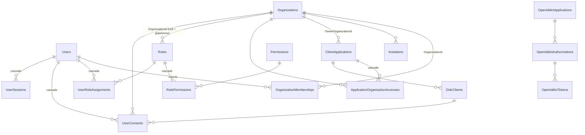

# 03 - Modèle de domaine et de persistance

Toutes les entités (sauf `Permission`, `RolePermission` et `AuditEntry`) héritent de `Entity` :
- `Guid Id` (v7) ;
- `CreatedAt` / `UpdatedAt` en UTC. Une date non UTC est rejetée, et toute lecture SQL est relue en UTC.

Les invariants sont imposés par les constructeurs et méthodes (setters privés) et testés dans `Cerberus.Domain.Tests`.

## 1. Entités et invariants

| Entité | Invariants principaux |
|---|---|
| `User` | Voir « Règles d'identité » (§1.1). Tout changement de login, d'email ou de statut fait tourner le security stamp ; `Disabled` interdit l'authentification |
| `Organization` | Nom obligatoire ; slug unique et immuable (`^[a-z0-9][a-z0-9-]{1,61}[a-z0-9]$`) ; `Suspended` interdit toute émission de token pour ce tenant |
| `OrganizationMembership` | Unique (organisation, utilisateur) ; statuts `Active`, `Suspended`, `Revoked` ; `Revoked` ne peut être ni suspendu ni repris (réactivation explicite uniquement via invitation ou ajout d'administrateur) |
| `Invitation` | Seul le hash SHA-256 du jeton est stocké ; usage unique, durée limitée ; acceptable uniquement par l'utilisateur dont l'email normalisé correspond |
| `ClientApplication` | Toujours une organisation propriétaire (réponse A) ; son accès existe toujours et ne peut être retiré ; `IsAvailableTo(org)` = application active **et** accès présent et activé |
| `ApplicationOrganizationAccess` | Unique (application, organisation) ; accordé ou retiré par la plateforme, suspendu ou repris par l'organisation |
| `OidcClient` | Voir « Règles des clients OIDC » (§1.2) |
| `ApiScope` | Nom valide, distinct des scopes standards ; resource = audience du token |
| `Permission` | Catalogue fixe en code (`PermissionCatalog`) avec portée `Platform` ou `Organization` ; répliqué en base via `HasData` (clés étrangères) |
| `Role` | Voir « Règles des rôles » (§1.3) |
| `UserRoleAssignment` | Voir « Règles d'affectation des rôles » (§1.4) |
| `UserConsent` | Une ligne par (user, client, organisation) ; scopes ⊇ `openid` ; `Covers(scopes)` faux si révoqué ou expiré ; `Renew` fusionne si actif, repart de zéro sinon ; `AuthorizationId` lie l'autorisation OpenIddict permanente |
| `UserSession` | Identifiant exposé en `sid` ; expiration glissante plafonnée par l'expiration absolue ; révocation terminale |
| `SigningKey` | Voir « Règles des clés » (§1.5) |
| `AuditEntry` | Immuable, sans secret ; détails tronqués à 4000 caractères |

### 1.1 Règles d'identité (`User`)
- Unicité du login et de l'email **après normalisation** : trim, Unicode NFKC, majuscules invariantes (`IdentityNormalizer`), garantie par des index uniques.
- Format du login : `^[a-zA-Z0-9._-]{3,64}$`.
- Email : forme `x@y.z`, 254 caractères maximum.
- La casse d'affichage est conservée.

### 1.2 Règles des clients OIDC (`OidcClient`)
- `client_id` unique et immuable.
- Au moins une redirect URI, chacune soumise à `RedirectUriRules` :
  - URI absolue ;
  - HTTPS obligatoire, sauf loopback ;
  - pas de fragment, pas de `*`, pas d'information utilisateur.
- `openid` est toujours inclus dans les scopes autorisés.
- Une durée de consentement n'est permise qu'avec la politique `Remembered`.

### 1.3 Règles des rôles (`Role`)
- `Platform` : pas d'organisation.
- `Organization` : exactement une organisation. Cette règle est **aussi** garantie par une contrainte CHECK SQL.
- Seules les permissions de la même portée sont acceptées.
- Nom unique dans sa portée.
- Les rôles système ne sont ni modifiables ni supprimables.

### 1.4 Règles d'affectation des rôles (`UserRoleAssignment`)
- Construction uniquement via des fabriques :
  - `ForPlatform` : rôle plateforme uniquement ;
  - `ForOrganization` : adhésion **active** à l'organisation du rôle.
- Une affectation incohérente, par exemple un rôle de l'organisation A affecté à un membre de B, est impossible à construire.

### 1.5 Règles des clés (`SigningKey`)
- Clé privée stockée chiffrée uniquement.
- Cycle de vie : `Pending` → `Active` → `Retired` (encore publiée) → `Expired`.
- `Revoke` retire immédiatement la clé.

### Portées des rôles

| Portée | Stockée dans l'IdP | Exemple | Effet |
|---|---|---|---|
| Globale | Oui (`RoleScope.Platform`) | `Platform administrator` | Administration de la plateforme, **jamais** émise dans les tokens |
| Organisationnelle | Oui (`RoleScope.Organization` + `OrganizationId`) | `Organization administrator`, `Sales` | Administration de l'organisation ; émise dans `org_roles` si le scope `org.roles` est accordé |
| Applicative | **Non** (réponse B) | `invoice.approve` | Gérée par chaque application, éventuellement à partir de `sub`, `org_id` et `org_roles` |
| Organisationnelle et applicative | **Non** | | Idem, responsabilité de l'application |

## 2. Relations de persistance



**Tables principales** : `Users`, `Organizations`, `OrganizationMemberships`, `Invitations`, `ClientApplications`, `ApplicationOrganizationAccesses`, `OidcClients`, `ApiScopes`, `Permissions`, `Roles`, `RolePermissions`, `UserRoleAssignments`, `UserConsents`, `UserSessions`, `AuditEntries`, `SigningKeys`, `DataProtectionKeys`.

**Tables OpenIddict** (clés `Guid`) :
- `OpenIddictApplications`, `OpenIddictAuthorizations`, `OpenIddictScopes`, `OpenIddictTokens`.
- `OidcClient` est la source de vérité ; `OidcClientRegistry` projette la configuration dans `OpenIddictApplications`, qui stocke aussi le secret haché.
- Le lien entre les deux est le `client_id`.

**Conventions** :
- Enums stockés en chaînes.
- Listes (redirect URIs, scopes) en colonnes JSON (collections primitives EF Core 10).
- Suppressions `Restrict`, sauf entités possédées (cascade).
- Index uniques nommés (`UniqueIndexNames`), traduits par `UnitOfWork` en `DuplicateEntityException`.

## 3. Migrations

- **Emplacement** : `Cerberus.Infrastructure/Data/Migrations`, commitées.
- **Générer une migration** :
  ```bash
  dotnet ef migrations add <Nom> -p Cerberus.Infrastructure -s Cerberus.Infrastructure -o Data/Migrations
  ```
  La factory design-time n'a pas besoin de base.
- **Vérifier** :
  ```bash
  dotnet ef migrations has-pending-model-changes -p Cerberus.Infrastructure -s Cerberus.Infrastructure
  ```
- **Appliquer** :
  - Development : automatiquement au démarrage (`Database:MigrateOnStartup=true`).
  - Autres environnements : bundle, voir 07.
