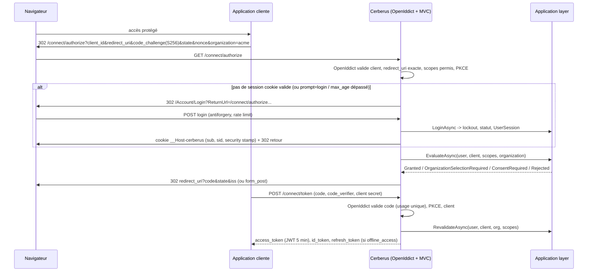
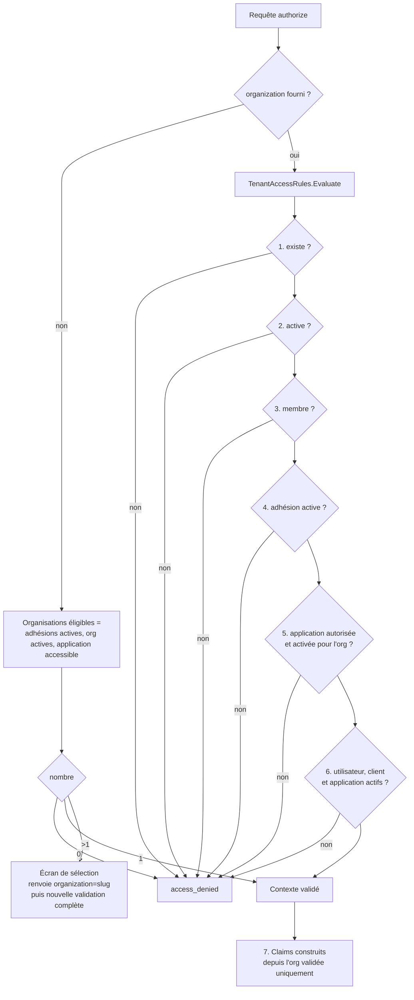
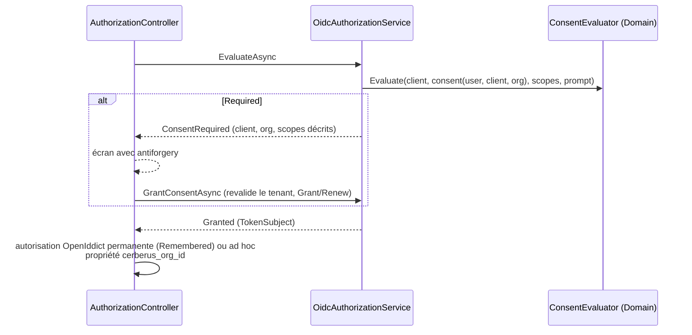

# 04 - Protocole, flux d'authentification, tenant et consentement

## 1. Endpoints

Endpoints publiés par OpenIddict (en passthrough vers `AuthorizationController` quand une décision métier est nécessaire) :

| Endpoint | Rôle |
|---|---|
| `/.well-known/openid-configuration` | Discovery |
| `/.well-known/jwks` | Clés publiques (actives, en attente et retirées non expirées) |
| `/connect/authorize` | Authentification, sélection d'organisation, consentement |
| `/connect/token` | `authorization_code` et `refresh_token` uniquement |
| `/connect/userinfo` | Claims du profil selon les scopes du token |
| `/connect/endsession` | Déconnexion, avec confirmation systématique (anti-CSRF) |
| `/connect/revocation` | Révocation de tokens par le client |

Flux **non activés** : implicit, hybrid, password (ROPC), client credentials, device.

**PKCE** : exigé globalement (`RequireProofKeyForCodeExchange`) **et** par client (`Requirements.Features.ProofKeyForCodeExchange`), y compris pour les clients confidentiels. C'est la recommandation OAuth 2.1 et du BCP sécurité : protection contre l'injection de code même si le secret fuit.

**Erreurs OIDC** : émises par OpenIddict.
- Si la redirect URI est validée, l'erreur est renvoyée au client (`access_denied`, `consent_required`, `login_required`, `interaction_required`, `invalid_grant`...).
- Sinon (client inconnu ou désactivé, redirect URI invalide, PKCE absent), une page 400 est affichée **sans redirection**.

## 2. Flux d'authentification (Authorization Code + PKCE)

**Sessions** :
- Cookie `__Host-cerberus` : `Secure`, `HttpOnly`, `SameSite=Lax`, 8 h glissantes.
- Chaque requête valide la `UserSession` : non révoquée, non expirée, expiration absolue de 24 h. Elle valide aussi le security stamp et le statut du compte.
- Déconnexion, reset de mot de passe ou désactivation : la session serveur est révoquée. Un cookie rejoué est refusé (test `Logout_ShouldRevokeServerSession_EvenIfOldCookieIsReplayed`).

## 3. Sélection et validation du tenant

**Transport** : paramètre d'autorisation `organization`, contenant le slug ou l'identifiant.
- C'est une **intention** : il n'est jamais cru.
- Choix documenté (D4) : paramètre d'extension OAuth 2.0 et non scope, pour ne pas détourner la sémantique des scopes.

**Garanties** :
- **Message d'erreur générique** : un même message pour tous les refus, pour ne pas révéler si une organisation existe. Le motif précis est dans l'audit (`oidc.tenant.rejected`).
- **Formulaire de consentement** : l'organisation postée est **revalidée** (test `ConsentForm_TamperedOrganization_ShouldBeRevalidated`).
- **Stockage de l'organisation validée** :
  - dans le claim privé `cerberus_org`, sans destination : présent uniquement dans le code et le refresh token chiffrés ;
  - dans la propriété `cerberus_org_id` de l'autorisation OpenIddict, pour permettre la révocation par organisation.
- **Revalidation** : à l'échange du code **et à chaque refresh**, `RevalidateAsync` repasse toutes les règles et reconstruit les claims (rôles à jour). Un membre suspendu, une organisation suspendue, un client désactivé ou un consentement révoqué font échouer avec `invalid_grant`.

## 4. Consentement

| Politique client | Comportement |
|---|---|
| `AlwaysPrompt` | Écran à chaque autorisation |
| `Remembered` sans durée | Premier consentement mémorisé, redemandé si de nouveaux scopes apparaissent |
| `Remembered` avec durée (jours) | Idem, avec expiration |
| `Trusted` | Client de confiance, configuré par un administrateur plateforme : pas d'écran |

`prompt=consent` force l'écran (sauf `Trusted`) ; `prompt=none` avec consentement requis renvoie `consent_required`.

**Granularité (D5)** :
- **Clé** : (utilisateur, client, organisation).
- **Conséquence fonctionnelle** : un utilisateur de deux organisations consent deux fois.
- **Conséquence de sécurité** : aucun contexte d'une organisation n'est libéré par un consentement donné pour une autre.

**Révocation** : via « My account » (`/Account/Manage`).
- Révoque l'autorisation OpenIddict liée et ses tokens.
- Le refresh échoue ensuite, et l'écran de consentement réapparaît (test `RevokedConsent_ShouldRevokeRefreshTokensAndPromptAgain`).

## 5. Tokens et clés

| Élément | Valeur |
|---|---|
| Algorithme de signature | RS256 (RSA 2048) |
| Chiffrement (codes, refresh tokens) | RSA-OAEP + A256CBC-HS512 |
| `iss` | `Oidc:Issuer`, fixé par configuration (ex. `https://localhost:5001/`) |
| `aud` (access token) | Resources des scopes d'API demandés et accordés (`ApiScope.Resource`) ; absent si aucun scope d'API |
| `kid` | Empreinte JWK SHA-256 (RFC 7638) de la clé publique |
| Access token | JWT `at+jwt`, **5 min**, non chiffré |
| ID token | JWT, 5 min, destiné au client uniquement (audience = client_id) |
| Code d'autorisation | 2 min, usage unique ; rejeu = révocation des tokens émis (test `ReusedAuthorizationCode...`) |
| Refresh token | 8 h, rotation à chaque usage, détection de réutilisation par OpenIddict, revalidation métier |

**Gestion des clés** :
- `SigningKeyManager` génère une paire RSA par usage.
- Il stocke la clé privée chiffrée par ASP.NET Core Data Protection. Les clés Data Protection sont elles-mêmes stockées dans la table `DataProtectionKeys`.
- Les clés ne sont **jamais** régénérées au démarrage si une clé active existe.

**Rotation** :
- **Durées** : clé active 90 j, successeur créé et publié 7 j avant activation, rétention de 30 j dans JWKS après retrait.
- **Vérification** : `KeyRotationHostedService` vérifie toutes les 6 h.
- **Prise en compte** : le jeu de clés chargé par OpenIddict est lu au démarrage. Une nouvelle clé devient la clé de signature au redémarrage suivant ; un avertissement est journalisé si ce redémarrage n'a pas eu lieu. La clé précédente reste publiée et valide pendant sa rétention, donc aucune rupture.
- **Compromission** : `SigningKey.Revoke`, puis redémarrage.

**Révocation** :

| Événement | Effet |
|---|---|
| Consentement révoqué | Autorisation et tokens liés révoqués |
| Utilisateur désactivé ou mot de passe réinitialisé | Toutes les sessions, autorisations et tokens (par `sub`) |
| Membre suspendu ou retiré | Autorisations et tokens de ce membre pour cette organisation |
| Organisation suspendue | Toutes les autorisations de l'organisation |
| Client ou application désactivé | Permissions OpenIddict retirées (authorize et token refusés), autorisations et tokens révoqués |
| Client lui-même | `/connect/revocation` |

**Limite** : un access token JWT déjà émis reste valide jusqu'à expiration (5 min maximum). Pour une opération sensible, l'API doit revérifier l'état métier (voir 06).

**ID token et access token** :

| | ID token | Access token |
|---|---|---|
| Destinataire | Le client (preuve d'authentification) | L'API (autorisation) |
| Audience | `client_id` | Resources des API |
| Contenu | `sub`, `sid`, `nonce`, profil/email selon scopes, `org_id`, `org_slug`, `org_roles` si demandé | `sub`, `client_id`, `scope`, `org_id`, `org_roles` si demandé |
| À envoyer à une API | **Jamais** | Oui |
